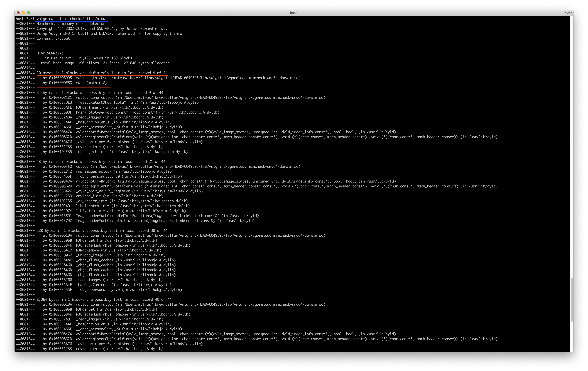
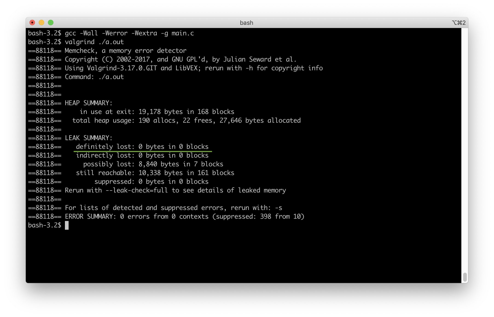

# Утечка памяти

## Что такое?

### Выделение памяти

Когда мы работаем с данными неопределенного размера (массивы, строки и т.п.) мы выделяем под них динамическую память.
Обычно это происходит с помощью команды `malloc()`.
Маллок возвращает указатель на память, которую он выделил `void*`, и мы записываем этот указатель в переменную.
Теперь мы можем читать/записывать по этому адресу (который лежит в переменной) выделенное количество байт.

В примере ниже мы выделяем память под 20 чаров, как-то с ней работаем и выходим из программы, предворительно освободив выделенное.

```C
#include <stdlib.h>
#include <unistd.h>

int main()
{
    char *str;
    
    str = malloc(sizeof(*str) * 20);        // выделение 20 байт памяти под строку
                                            // теперь в str лежит указатель на эту память
                                     
    *str = 'a';                             // *str - значение первого (нулевого) байта из этой памяти
    *(str + 3) = 'd';                       // *(str + 3) - значение четвертого (третьего) байта и т.д.
                                            // N.B. запись *(str + 3) эквивалентна str[3]
    
    free(str);                              // освобождаем память
    
    return (0);
}

```

### Утечка памяти

Утечка памяти происходит в тот момент, когда мы **теряем возможность** освободить то, что было выделенно.

В примере ниже мы просто меняем значение переменной str, то есть навсегда теряем адрес памяти, которая была выделена.

```C
#include <stdlib.h>
#include <unistd.h>

int main()
{
    char *str;
    
    str = malloc(sizeof(*str) * 20);        // выделение 20 байт памяти под строку
                                            // теперь в str лежит указатель на эту память
                                     
    *str = 'a';                             // *str - значение первого (нулевого) байта из этой памяти
    *(str + 3) = 'd';                       // *(str + 3) - значение четвертого (третьего) байта и т.д.
                                            // N.B. запись *(str + 3) эквивалентна str[3]
                                            
    str = NULL;                             // утечка тут, мы потеряли выделенный malloc'ом адрес
    
    free(str);                              // free() не выдает ошибку при аргументе NULL
    
    return (0);
}

```

## Почему это плохо?

Представим ситуацию: вы написали компьютерную игру с утечками в какой-то функции, например в `ft_strjoin()`. Каждый раз при вызове этой функции программа будет увеличивать количество памяти, которую она потребляет (можно посмотреть сколько памяти выделено под каждый запущенный процесс командой `top`). Указатели на выделяемую память теряются, эта память не фришится, и в какой-то момент операционная система говорит "Мои ресурсы закончились". `malloc()` возвращает `NULL`, ваша программа понимает (надеюсь, вы написали защиту для маллока\*), что что-то идет не так и завершает свою работу с каким-то кодом ошибки. Пользователь в недоумении, почему у него вылетела игра в самый ответственный момент.

## Как искать лики?

В целом школьных маках можно использовать 2 программы для поиска утечек: `valgrind` и `leaks`

### valgrind

[Гайд по установке на mac](https://github.com/daniiomir/faq_for_school_21#%D1%83%D1%81%D1%82%D0%B0%D0%BD%D0%BE%D0%B2%D0%BA%D0%B0-valgrind-%D0%B4%D0%BB%D1%8F-%D0%BF%D0%BE%D0%B8%D1%81%D0%BA%D0%B0-%D1%83%D1%82%D0%B5%D1%87%D0%B5%D0%BA)

* Шаг 1: скомпилировать свою программу с флагом `-g`

При этом в текущей директории появятся дополнительный каталог \*dSYM, после проверки на утечки его можно будет удалить.


* Шаг 2: запустить `valgrind` передав ему в аргументы вашу программу (`a.out`)

Валгринд запустит вашу программу и после её завершения предоставит отчёт о её работе. Нас интересует строка `defenetly lost` (красный). Валгринд говорит нам, что у нас утекло 20 байт (как неожиданно!).


<div>
  
</div>
<br>

* Шаг 3: перезапустить `valgrind` с флагом `--leak-check=full`.

Если забыли флаг, он всегда показывается при обычном выводе валгринда (синий на предыдущем скриншоте).

Сейчас главное не испугаться ОГРОМНОГО ВЫВОДА ВСЕГО ЧТО НАШЕЛ VALGRIND :) (о том, что он там еще находит будет написано ниже)


В каждом блоке найденной ошибки валгринд показывает стек вызова функций (функции, которые мы вызывали в обратном порядке). Если то что там написано вообще не имеет отношения к тому, что вы писали в своей программе - забудьте об этом. Валгринд погавкал на прохожих.

* Шаг 4: найти место где утекло именно у вас

В примере видно, что в блоке defenetly lost в функции `main` был вызван `malloc`. Утекла именно та память, которую выделил этот маллок.



* Шаг 5: найти и исправить утечку

```C
#include <stdlib.h>
#include <unistd.h>

int main()
{
    char *str;
    
    str = malloc(sizeof(*str) * 20);                                                                     
    *str = 'a';                           
    *(str + 3) = 'd';                    
                                            
    free(str);                      // память не потеряна, утечка устранена
    str = NULL;                     // перезаписывать str безопасно
    
    free(str);
    return (0);
}

```

После того, как мы поправим утечку, валгринд не обнаружит проблем.



P.S. `valgrind` не "родной" для мака! Поэтому иногда **он может ошибаться**. Посмотрите [гайд amatilda](https://github.com/daniiomir/faq_for_school_21/blob/master/docs/memory_leaks_amatilda.pdf) в каких случаях валгрин считает за утечку то, что не является утечкой. 

### leaks

Это родная для мака програма для поиска утечек для вашей программы. Хотя она и чекает менее тщательно (тут нужно сделать оговорку, что я не изучал leaks глубоко, просто пытался им пользоваться и делюсь опытом), её можно использовать.

* Шаг 1: "Подвешиваем" выполнение нашей программы

```C
#include <stdlib.h>
#include <unistd.h>

int main()
{
    char *str;
    
    str = malloc(sizeof(*str) * 20);
    *str = 'a';                     
    *(str + 3) = 'd';                     
    str = NULL;
    free(str);
    while (1)         // программа никогда не завершит свою работу штатно
        ;
    return (0);
}
```

* Шаг 2 и 3: запускаем программу в одном терминале, leaks - в другом


Мы точно знаем, что указатель утёк, однако leaks не считает это проблемой :/ 

Подробности этого поведения конечно же есть [тут](www.google.com).

## Нужно ли освобождать память перед выходом из программы?

Да, но это не обязательно (почти). Ха-ха, какой понятный ответ :)

После завершения работы вашей программы вся память, которую операционная система дала вашей программе, освободится сама (снова станет доступна системе). Но так бывает не всегда, немного больше подробностей в [гайде amatilda](https://github.com/daniiomir/faq_for_school_21/blob/master/docs/memory_leaks_amatilda.pdf). 


## Если valgrind показыват 100500 ошибок и 0 утечек?

`valgrind` может показывать читаете/запись из незамаллоченной памяти!

Пример неправильного ft_strdup()


```C
#include <string.h>
#include <stdlib.h>

char *ft_strdup(char *str)
{
    char    *new_str;
    size_t  str_len;
    
    str_len = strlen(str);
    new_str = malloc(sizeof(*new_str) * str_len);
    if (new_str == NULL)                             // *так выглядит защищенный маллок
        return NULL;               
    memcpy(new_str, str, str_len);
    new_str[str_len] = '\0';
    return (new_str);
}

int main()
{
    char *s;
    
    s = ft_strdup("Hello World!");
    return (0);
}
```

Посмотрим, что нам выведет valgrind:


Invalid write в ft_strdup(), да еще и что-то утекло! 

Invalid write появляется когда мы пытаемся записать что-то в незамаллоченную память.

Смотрим код - там действительно ошибка. Исправляем...

```C
#include <string.h>
#include <stdlib.h>

char *ft_strdup(char *str)
{
    char    *new_str;
    size_t  str_len;
    
    str_len = strlen(str);
    new_str = malloc(sizeof(*new_str) * (str_len + 1));      // исправили ошибку выделения памяти
    if (new_str == NULL)                                   
        return NULL;               
    memcpy(new_str, str, str_len);
    new_str[str_len] = '\0';        // Invalid write был тут. Мы записывали 0 в незамоллоченное место
    return (new_str);
}

int main()
{
    char *s;
    
    s = ft_strdup("Hello World!");
    return (0);
}
```

Проверяем 


Утечка памяти осталась, хотя мы знаем, что строковые литералы (аргумент, который мы передаем в ft_strdup) не могут течь. Валгрнид и вправду иногда ошибается по поводу утечек памяти, но ошибки он ловит хорошо. Обращайте на них внимание!

Успехов в скоростной сдаче проектов!
