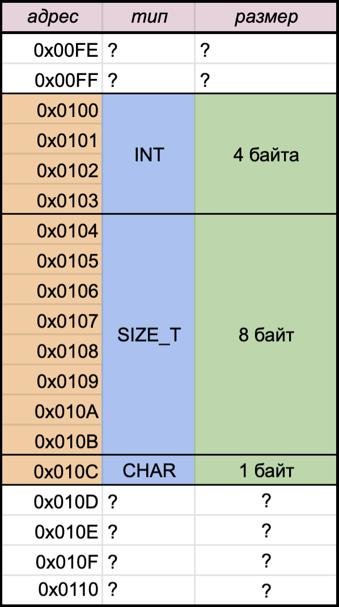
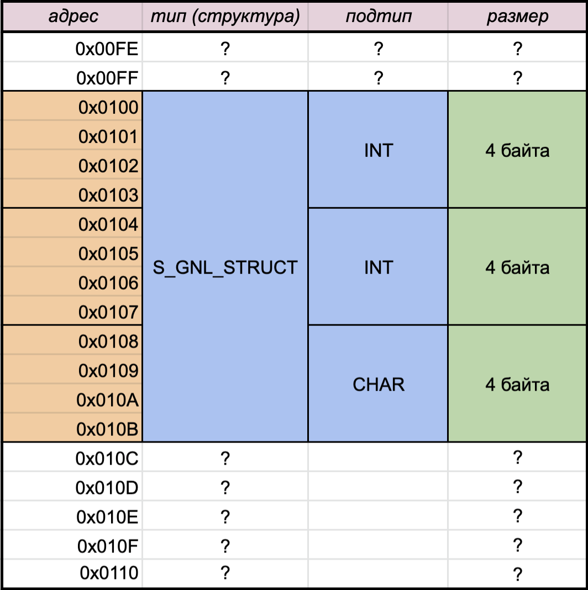

# Структуры в Си

## Что такое?

Структура - это абстракция над переменными. Условный "мешок" в котором может храниться несколько переменных.
Как и у обычной переменной у структуры есть свой тип и имя.

```C
Тип_переменной     Имя_переменной

int                fd;
_тип_структуры_    gnl_struct;
```

## Как создать структуру?

Поскольку Си не знает заранее, какие структуры мы хотим использовать, то нам нужно их определить.

```C
#include "my_super_header.h"

struct s_gnl_struct
{
    int   fd;
    int	  last_readed;
    char  unicorn;
};

int main()
...
```

Теперь компилятор в Си знает, что есть **тип данных** `struct s_gnl_struct` и поэтому его можно использовать.

## Пример использования

```C
    ...
    
int main()
{
    struct s_gnl_struct a;

    a.fd = 3;
    a.last_readed = 43;
    a.unicorn = 'U';

    printf("%d, %d, %c\n", a.fd, a.last_readed, a.unicorn);

    return 0;
}
```

В примере мы создали "мешок с переменными" который имеет **тип** `struct s_gnl_struct` и **имя** `a`
Обращения к содержимому "мешка" происходит через "."

## Расположение в памяти

Любая переменная в вашей программе занимает какое-то место в памяти. Например int - 4 байта, size_t - 8, char - 1 и т.д.

Сколько места в памяти занимает структура?

Очевидно, что как минимум столько, сколько занимают все переменные из структуры. Для нашего примера int + int + char = 4 + 4 + 1, то есть **как минимум** 9 байт  (на самом деле 12, ниже показано почему так происходит и как это выглядит).

**Больше примеров**

На картинке показано как хранятся **отдельные** переменные в памяти компьютера. Оранжевый - адреса ячеек памяти; синий - размер, который занимает конкретный тип; зелёный - количество байт, которые заняты, белый - рандомная память.

int, size_t, char где-то в памяти компьютера:

<div>
  
</div>
<br>

В отличие от обычных переменных тип структуры целостный, и для быстрого доступа к полям структуры происходит т.н. выравнивание полей (для ускорения вычислений). К полям структуры могут быть добавленны пустые байты, чтобы итоговый размер структуры был кратен размеру типа, который имеет наибольший размер. Непонятно сказанно, но на примере к типу char добавляется 3 байта, чтобы его размер стал кратен 4 (т.е. размеру int). 


Так выглядит s_gnl_struct где-то в памяти:

<div>
  
</div>
<br>

Причина, почему под char выделяется 4 байта (**ТАК БЫВАЕТ НЕ ВСЕГДА**) - тема отдельного топика. Можно погуглить _padding in memory_, например вот [хорошая статья про выравнивание структур в Си](https://fresh2refresh.com/c-programming/c-structure-padding/#:~:text=In%20order%20to%20align%20the,concept%20is%20called%20structure%20padding.)

P.S. Если мы добавим в структуру еще один char **в конце** размер структуры все еще останется 12. А если мы добавим этот char **в начало** то размер структуры станет 16. Подробнее про это в статье выше.

## А где typedef?

typedef - это просто слово для объявления **пользовательского** (то есть нашего собственного) типа. Чтобы при объявлении структур не писать много раз 

```C
struct s_gnl_struct b;

struct s_gnl_struct other;
```

можно при объявлении структуры написать

```C
#include "my_super_header.h"

typedef struct  s_gnl_struct
{
    int   fd;
    int   last_readed;
    char  unicorn;
}               t_gnl;

int main()
...
```

теперь вместо огромного и плохо читаемого `struct s_gnl_struct other;` можно писать `t_gnl other;`

```C
int main()
{
    t_gnl a;
  ...
}
```

## Напоминалка про динамическое выделение

Как и все другие переменные структуру можно просто создать (в стековой памяти):

```C
int main()
{
    t_gnl a;
  
    a.fd = 123;
  ...
}
```
Эта структура просто является переменной и к этой переменной нужно обращаться через  `.`

Структуру можно создать в динамической памяти, и обращаться к ней через указатель:

```C
int main()
{
    t_gnl *ptr_to_struct;
    ptr_to_struct = malloc(sizeof *ptr_to_struct); // Не забывайте ставить * !
  
    (*ptr_to_struct).fd = 321;
    ...
}
```

Здесь мы выделили динамическую память, чтобы в ней лежала наша структура, и присвоили указатель на эту память (то что вернул malloc() ) в переменную указателя на структуру.

P.S. Если забыть поставить `\*`, то вместо N байт, которые нужны нам для структуры выделится 8 байт ( размер указателя ). Эту ошибка приводит к трудно воспроизводимым segmentation fault, и долгим часам дебага программы на Си.

P.S.S. Я часто вижу таккую запись

```C
    ptr_to_struct = (t_gnl*)malloc(sizeof(t_gnl) * 1); // Нет ошибки
```

По логике она ничем не отличается от примера выше. Здесь всё еще есть риск поставить лишнюю `*` и пострадать от сегфолтов

```
    ptr_to_struct = (t_gnl*)malloc(sizeof(t_gnl*) * 1); // Ошибка
```

И некоторые программисты считают, что запись из первого примера читается лучше (нет лишнего приведения типов, и не указываются избыточные скобочки в sizeof) по мне так это дело вкуса, [подробнее про оформление маллока тут](https://stackoverflow.com/questions/605845/do-i-cast-the-result-of-malloc)


## Магическая ->

Обращаться к полям структуры можно все ещё через `.`, но необходимо написать много лишних символов. `*` для разыменования указателя, `( )` для указания приоритета операций, и только потом `.`! И всё это слева и справа от имени указателя на структуру.

_Для упрощения жизни_ придумали оператор `->` который позволяет **через указатель** на структуру обратиться к её полям.

```C
int main()
{
    t_gnl *ptr_to_struct;
    ptr_to_struct = malloc(sizeof *ptr_to_struct); // Не забывайте ставить * !
  
    ptr_to_struct->fd = 321;
    ...
}
```

Еще раз: если у вас есть **указатель** на структуру к ее полям можно обращаться через `->`. Если у вас есть **просто структура** то к её полям нельзя обращаться через `->` (что в принцепе бессмысленно), к её полям нужно обращаться через `.`

## Битовые поля

В структуре можно дать имена каждому биту какого-либо типа. Смотрим код:

```
struct s {
    unsigned int b1:1;
    unsigned int b2:1;
    unsigned int b3:1;
    unsigned int b4:1;
    unsigned int f1:10;
    unsigned int f2:10;
};
```

Данная структура займёт в памяти 4 байта (!).

Работает это следующим образом. Мы создаём структуру, в которой хранится тип `unsigned int`, размер этого типа - 4 байта или 32 бита. Полсе `:` мы указываем, сколько бит от этого типа будет занимать поле.

При объявлении структуры как в коде выше поля b1, b2, b3, b4 будут иметь размер **1 БИТ**, а f1, f2 соответственно по 10 бит. Эта штука может быть очень полезна, если вы хотите экономно хранить множество каких-либо флагов и иметь очень удобное к ним обращение.

Пример для флагов в ft_printf

```
struct s_flags {
    unsigned char dash:1;
    unsigned char zero:1;
    unsigned char space:1;
    unsigned char hash:1;
    unsigned char plus:1;
};

{
    ...
    struct s_flags flags;
    ...
    if ( flags.space )
    {
        // сделать что-то если установлен флаг пробел
    }
    ...
}
```

размер структуры flags - 1 байт! 


## Где применять

Структуры хорошо использовать там, где требуется хранить много связанных по смыслу переменных в одном месте. Относительно школьных проектов, например - это значения спецификаторов формата в ft_printf, структура хранящая информацию о последнем считывании в get_next_line, или структура структур, которая хранит всю информацию об игре cub3D.
